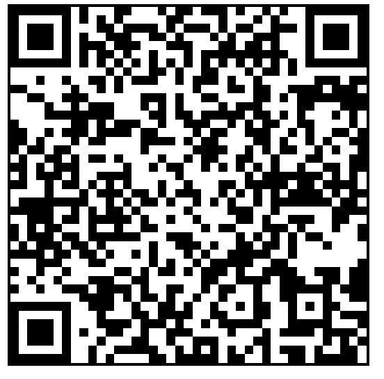

# [home](index.html)

## Plan for immediate development:

 - build model of information flow with physical media and digital diagram
 - only update json in html when json has been updated with python✅
 - control vna state from html✅
 - phase mode
 - add details for how to use this software to this document
 - add qr code to this document
 - save and load phase delay and mag range in json
 - click to save .png
 - click to save .s2p
 - add note metadata
 - add json values of vna state and exact time and date to comment in s2p
 - test for large data sets
 - add decimation for large data sets
 - add switch control with MEMSduino
 - add switch control with Minicircuits switches for dil fridge operation

# [vna-control](https://github.com/lafefspietz/vna-control)

 - [vna.html](vna.html)
 - [vna-live.ipynb](vna-live.ipynb)
 - [gpib-sandbox.ipynb](gpib-sandbox.ipynb)
 - [get-trace.ipynb](get-trace.ipynb)
 - [qrcode.html](qrcode.html)